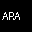
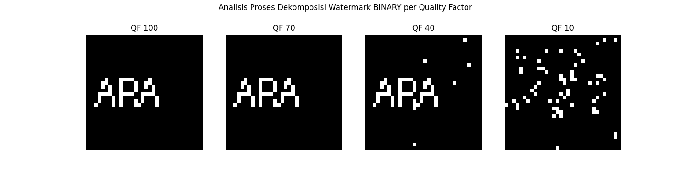
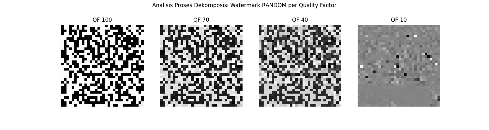
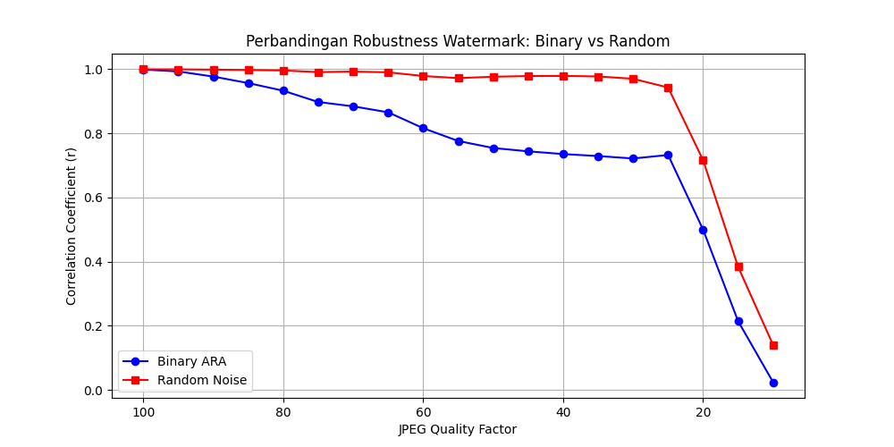

# DCT Watermarking - Zahrah Nur A

<small> dct-watermarking adalah sebuah alat eksperimental berbasis Python untuk menyematkan watermark digital ke dalam citra (foto wajah) menggunakan domain frekuensi. Tugas ini dibuat untuk memenuhi tugas Sistem Multimedia dengan fokus utama pada pengujian **robustness** (ketangguhan) terhadap kompresi JPEG. </small>
---

## Supported Algorithms

Tugas ini mengimplementasikan dua jenis watermark yang berbeda untuk membandingkan kinerjanya:

* **Metode A (Binary Image):** > Membuat citra biner (hitam-putih) berukuran $32 \times 32$ yang membentuk teks **"ARA"**.
* **Metode B (Random PN-Sequence):** > Membuat deret angka acak (*Pseudo-Noise sequence*) dengan nilai $-1$ atau $+1$.

**Background:**

* **Discrete Cosine Transform (DCT):** Watermark disisipkan pada koefisien *mid-frequency* (blok $8 \times 8$) untuk menyeimbangkan antara *imperceptibility* (tidak terlihat) dan *robustness* (tahan banting).
---

## Install Libraries

Pastikan kamu sudah menginstal pustaka yang diperlukan:
```bash
pip install opencv-python numpy matplotlib pillow
```

## Library Usage

### 1. Membuat Watermark & Embedding
Contoh cara menyematkan teks "ARA" ke dalam koefisien DCT kanal luminansi (Y):
```python
wm_bin = create_binary_wm()
wm_rnd = create_random_wm()

img_wm_bin = embed_dct(orig, wm_bin, alpha)
img_wm_rnd = embed_dct(orig, wm_rnd, alpha)
```

### 2. Ekstraksi & Evaluasi
Mengekstrak watermark dari citra yang sudah dikompresi:
```python
ext_bin = extract_dct(simulate_jpeg(img_wm_bin, 80), orig, alpha)
ext_rnd = extract_dct(simulate_jpeg(img_wm_rnd, 80), orig, alpha)
```
---

## Test Results

Pengujian dilakukan dengan mengompresi citra ber-watermark menggunakan berbagai *Quality Factor* (QF).

**Metrik:** Keberhasilan ekstraksi diukur menggunakan **Pearson Correlation Coefficient ($r$)**.

| Quality Factor (QF) | Visual Status | Correlation ($r$) | Keterangan |
| --- | --- | --- | --- |
| **100** | Terbaca Jelas | ~0.99 | Tanpa kehilangan data berarti. |
| **80** | Terbaca Jelas | ~0.85 | Standar optimasi web. |
| **60** | Mulai Rusak | ~0.60 | Artefak JPEG mulai mengganggu. |
| **40** | Rusak Parah | ~0.35 | Watermark sulit dikenali secara visual. |
| **20** | Tidak Terbaca | < 0.20 | **Titik Kegagalan:** Watermark hancur. |

### Visual Comparison

| Deskripsi | Gambar |
| :--- | :--- |
| **Hasil Ekstraksi (Visual)** |  |
| **Proses Dekomposisi WM Binary** |  |
| **Proses Dekomposisi WM Random** |  |
| **Grafik Ketangguhan WM** |  |

## Kesimpulan Tugas

Berdasarkan pengujian, watermark mulai **tidak dapat diekstrak (tidak terbaca)** secara efektif pada nilai **Quality Factor $\le 30$**. Hal ini dikarenakan algoritma kompresi JPEG membuang koefisien frekuensi tinggi dan menengah di mana data watermark disimpan.